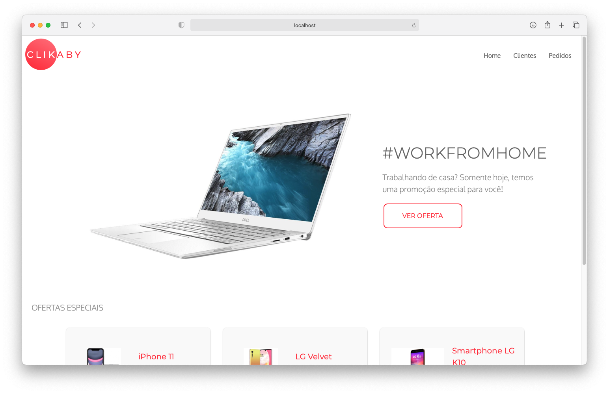

# Projeto BigCorp E-Commerce LTDA



### Requisitos (Runtime):

- NodeJS
- AngularJS (forkado de https://github.com/angular/angular-seed)
- Python 3 (API)
- Pip + Virtualenv (API)


### Requisitos (Development):

- Live Sass Compiler (Visual Studio Code) para o pré-processador de CSS

## Instruções (Front-End)

- Instalar as dependências com `npm install`
- Executar a aplicação com `npm start`

## Instruções (API - MacOS)

A aplicação vem pré-configurada com uma API já publicada no Heroku. Caso prefira, você pode executá-la em ambiente de desenvolvimento local seguindo esses passos:

- Instalar o Python 3 do site oficial
- Instalar o pip usando o comando `python3 -m pip install pip --upgrade`
- Instalar o Virtualenv usando o comando `sudo pip install virtualenv`
- Na pasta do projeto, criar o ambiente virtual usando o comando `virtualenv <<Nome do ambiente>>`
- Ativar o ambiente usando o comando `source <<Nome do ambiente>>/bin/activate`
- Instalar as dependências usando o comando `pip install requirements.txt`
- No arquivo `app.py`, comentar as linhas para execução em produção:
    ```
    port = int(os.environ.get('PORT', 5000))
    app.run(host='0.0.0.0', port=port)
    ```
- descomentar a linha de execução em ambiente dev (`app.run()`)
- Iniciar a aplicação usando o comando `python3 app.py` 